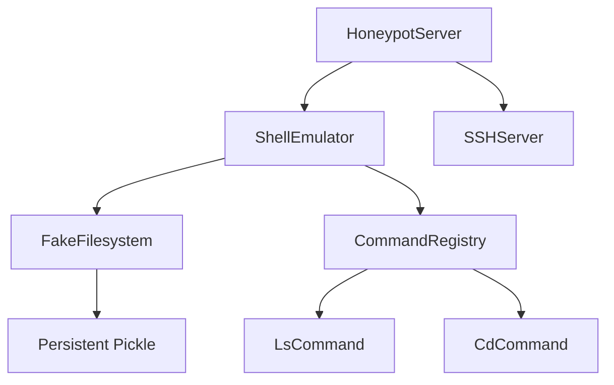

# Developer Documentation

This guide is intended for developers who want to contribute to the Cyanide Honeypot project, add new features, or debug code.

## 🛠️ Development Environment Setup

Since the project uses **Docker** for runtime, your development workflow will involve editing code locally and reflecting changes in the container.

### 1. Local Python Setup (For IDE Support)
While you run the project in Docker, you should set up a local virtual environment so your IDE (VS Code, PyCharm) can provide autocompletion and linting.

```bash
# Create venv
python3 -m venv .venv
source .venv/bin/activate

# Install dependencies (development)
pip install -r requirements.txt
pip install pytest pytest-asyncio
```

### 2. Docker Development Workflow
The `docker-compose.yml` mounts the source directories (`src/`, `var/`) into the container. This means **changes to python files in `src/` are reflected immediately** upon container restart (or valid hot-reload if configured).

**Running in Debug Mode:**

```bash
# Start container
docker compose -f docker/docker-compose.yml up --build

# In a new terminal, check logs
docker compose -f docker/docker-compose.yml logs -f
```

**Rebuilding:**
If you change `requirements.txt` or `Dockerfile`, you MUST rebuild:
```bash
docker compose -f docker/docker-compose.yml up --build -d
```

---

## 🧪 Testing

We use `pytest` for unit and integration testing.

### Running Tests (Inside Docker - Recommended)
To ensure the environment matches production:

```bash
docker exec -it cyanide_honeypot pytest tests/
```

### Running Tests (Locally)
If you have all dependencies installed locally:

```bash
export PYTHONPATH=$PYTHONPATH:$(pwd)/src
pytest tests/
```

### Writing New Tests
*   **Location**: `tests/` directory.
*   **Naming**: Files must start with `test_`.
*   **Async**: We use `unittest.IsolatedAsyncioTestCase` for async tests.

**Example:**
```python
import unittest
from core.some_module import SomeClass

class TestFeature(unittest.IsolatedAsyncioTestCase):
    async def test_my_feature(self):
        obj = SomeClass()
        result = await obj.async_method()
        self.assertTrue(result)
```

---

## 🏛️ Architecture Overview

The application is an asynchronous event-driven server based on `asyncio`.

1.  **Entry Point**: `main.py` -> `src/core/server.py:HoneypotServer.start()`
2.  **Protocol Handlers**:
    *   `src/core/server.py` handles Telnet.
    *   `src/proxy/ssh_proxy.py` handles SSH (via `asyncssh`).
3.  **Command Execution**:
    *   Input is passed to `src/core/shell_emulator.py`.
    *   Emulator parses syntax (`|`, `>`, `&&`).
    *   Commands are delegated to classes in `src/commands/*.py`.
4.  **Filesystem**:
    *   `src/core/fake_filesystem.py`: In-memory object tree.
    *   `share/cyanide/fs.pickle`: Persisted state.

### Key Class Interactions



---

## 🧩 Extending functionality

### Adding a New Command
To add a command like `service`:

1.  **Create file**: `src/commands/service.py`
2.  **Implement class**:
    ```python
    from .base import Command
    
    class ServiceCommand(Command):
        async def execute(self, args, input_data):
            if not args:
                 return "", "Usage: service <name> <action>\n", 1
            if args[0] == "apache2" and args[1] == "restart":
                 return "Restarting apache2... OK\n", "", 0
            return "", "Service not found\n", 1
    ```
3.  **Register**: Add to `src/commands/__init__.py`.
    ```python
    from .service import ServiceCommand
    COMMAND_MAP = { ..., "service": ServiceCommand }
    ```

### Adding a New Proxy Protocol
1.  Use `src/proxy/tcp_proxy.py` as a base or reference.
2.  Implement a class inheriting from `TCPProxy` or create a standalone asyncio server.
3.  Initialize it in `HoneypotServer.start()`.

---

## 🐛 Debugging

### Logging
All application logs go to stdout (Docker logs) and `var/log/cyanide/cyanide.json`.
*   Use `logger.info()` for general events.
*   Use `logger.debug()` for verbose developer info (requires `--debug` flag).

### Common Issues
*   **"Address already in use"**: Check if another container or system process is using port 2222/2223.
*   **"Module not found"**: Ensure `PYTHONPATH` includes `src/`. Docker handles this automatically.
*   **"Permission denied" on persistence**: Check file permissions on `share/cyanide/fs.pickle`. The container runs as user `cyanide` (UID often 1000 or 999).

## 📦 Release Process

1.  Bump version in `src/core/__init__.py` and `README.md`.
2.  Update `CHANGELOG.md`.
3.  Build and test Docker image:
    ```bash
    docker build -t cyanide:latest -f docker/Dockerfile .
    ```
